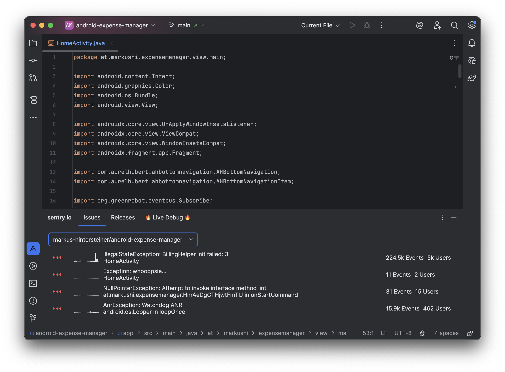
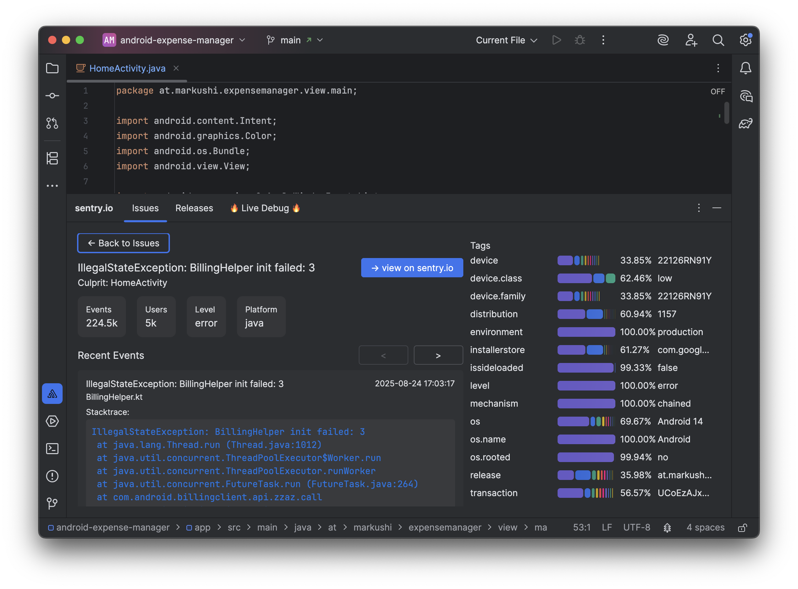
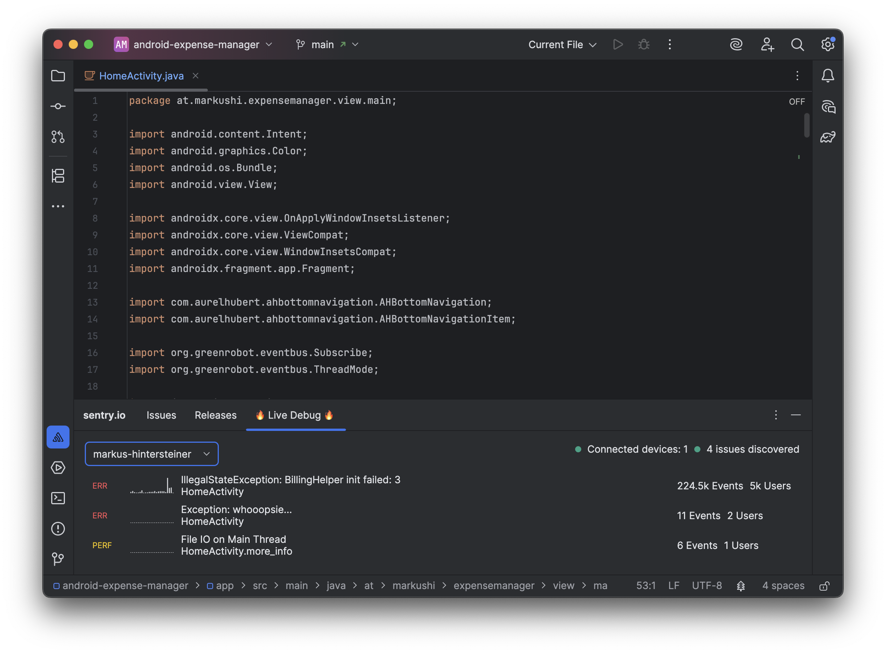

## Sentry IDE Plugin (Hackweek Project)

This is a Sentry Hackweek project that experiments with a lightweight Sentry integration for JetBrains IDEs. It focuses
on browsing issues, checking release health (TODO), and live debug information directly inside the IDE.

### Feature Set

#### Issue Explorer




#### Issue Explorer

TODO: Implement

#### Live Debug

The Sentry IDE plugin automatically connects to your local emulators and devices and monitor them.
This way you'll get notified about any new issues before you even commit your code changes.



### Requirements

- JDK 21

### Authentication

The plugin requires a valid Sentry API token to talk to Sentry. A token can be generated
on https://sentry.io/settings/account/api/auth-tokens/

- Environment variable: `SENTRY_TOKEN`
- It must be set in your shell/session before running any Gradle tasks that start the IDE or access the API.

Example:

```bash
SENTRY_TOKEN=your_sentry_api_token ./gradlew runIde
```

### Project Notes
- Heavily inspired by the following template https://github.com/rock3r/jewel-ijp-template/tree/243-and-251-compat


